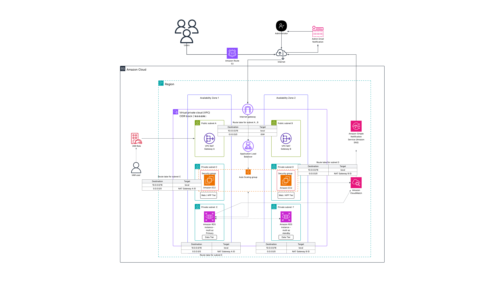

# 🚀 Scalable 2-Tier Web Application on AWS

This project demonstrates how to deploy a scalable and highly available 2-tier web application on AWS using EC2, ALB, Auto Scaling, RDS, IAM, CloudWatch, and SNS.
The architecture is designed following AWS best practices, ensuring security, scalability, and resilience across multiple Availability Zones (AZs).
## 📌 Architecture
- **Tier 1:** Web + App (EC2 + ASG + ALB)
- **Tier 2:** Database (RDS Multi-AZ).
- The setup also includes CloudWatch + SNS for monitoring and alerting.

## 🏗️ Architecture Diagram 

## 🏗️ Architecture Components: 
- VPC with public and private subnets across two Availability Zones (AZs).
- Internet Gateway for external access.
- NAT Gateway in public subnets for private instances to securely reach the internet.
- Application Load Balancer (ALB) to distribute traffic across EC2 instances.
- EC2 Auto Scaling Group (ASG) to automatically scale the web/application servers.
- Amazon RDS (Multi-AZ) for database high availability.
- IAM Roles for secure AWS resource access.
- CloudWatch + SNS for monitoring and alerting. 

## ⚙️ Deployment Steps

### 1. Networking (VPC & Subnets)
- Amazon VPC (10.0.0.0/16) → Isolates application resources in a secure network.
- Subnets: 
- Public Subnets (A & B) → Host the NAT Gateways and Application Load Balancer (ALB).
- Private Subnets (C & D) → Host EC2 instances (Web/App tier) in an Auto Scaling Group.
- Private Subnets (E & F) → Host Amazon RDS instances (Database tier).
- Internet Gateway (IGW) → Provides internet access to public subnets.
- NAT Gateways (A & B) → Allow EC2 instances in private subnets to access the internet securely. 

### 2. Security: 
- Security Groups → Control inbound/outbound traffic for EC2, ALB, and RDS.
- IAM Roles & Users → Enforce least-privilege access to AWS resources.

 ### 3. Application Layer: 
- Amazon Route 53 → Provides DNS resolution and routes user traffic to the ALB.
- Application Load Balancer (ALB) → Distributes traffic evenly across EC2 instances in multiple AZs.
- Amazon EC2 (Auto Scaling Group) → Hosts the web application, ensuring high availability and scalability.

### 4. EC2 Auto Scaling Group (Web/App Tier)
- Create a Launch Template with AMI, instance type, and user data script.
- Place EC2 instances in private subnets.
- Attach to an Auto Scaling Group (ASG) with scaling policies (e.g., CPU > 70%).

### 5. Database (Amazon RDS – Data Tier)
- Amazon RDS (Multi-AZ Deployment) → Provides a highly available relational database.
   - Primary instance in one AZ.
   - Standby replica in another AZ for failover.

## 📊 Monitoring & Alerting:
- Amazon CloudWatch → Monitors infrastructure metrics (CPU, memory, network).
- Amazon SNS (Simple Notification Service) → Sends email alerts to administrators for critical events.

Key Metrics to monitor:
- EC2 → CPU Utilization, Memory, Disk.
- ALB → Request count, Latency, 4xx/5xx errors.
- RDS → Free Storage, Connections, Latency.
### 🔹 Amazon SNS
- Integrated with CloudWatch Alarms.
- Sends email notifications to admins when alarms trigger.

## 🔄 Request Flow: 
- Users request www.myapp.com.
- Amazon Route 53 resolves the domain and directs traffic to the ALB.
- ALB forwards requests to EC2 instances in private subnets (C & D).
- EC2 instances process the request and interact with RDS in subnets (E & F).
- CloudWatch + SNS provide monitoring and alerting for system health.

## ✅ Benefits of This Architecture: 
- High Availability → Resources deployed across 2 Availability Zones.
- Scalability → Auto Scaling Group adjusts capacity based on traffic.
- Security → Private subnets, NAT gateways, IAM roles, and security groups.
- Fault Tolerance → Multi-AZ RDS ensures database failover.
- Monitoring → CloudWatch + SNS for proactive system health alerts.
